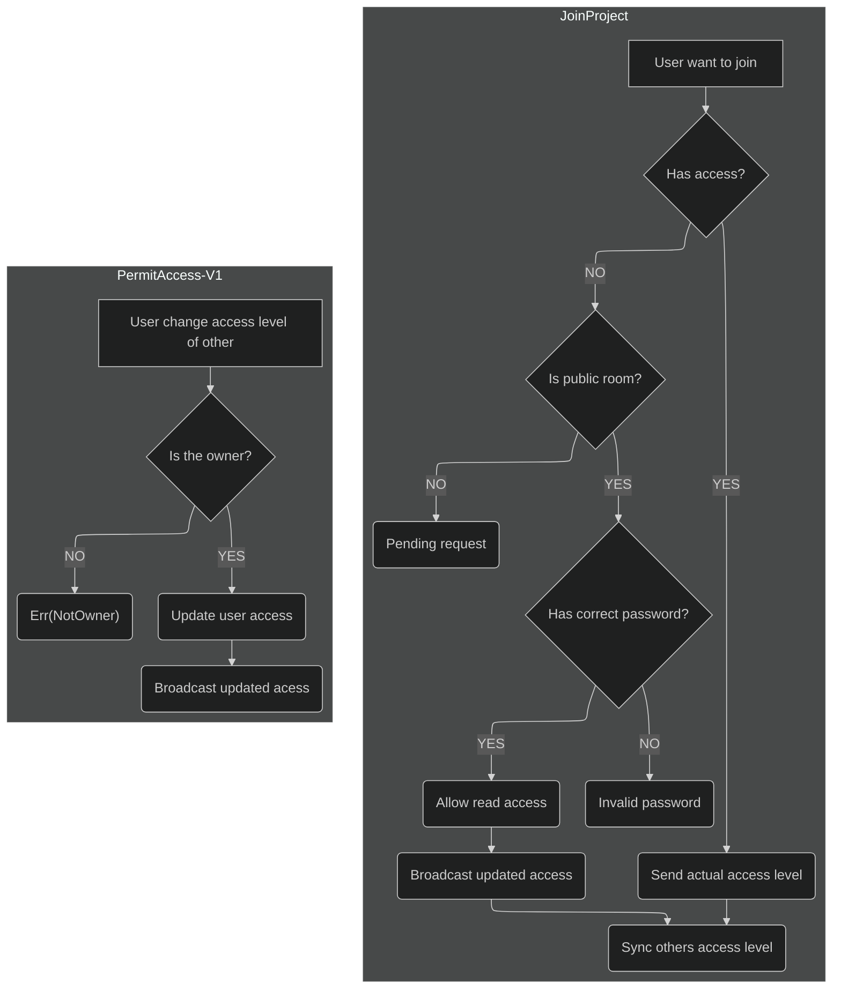

# Things to know
The prefix `Rg` (Ej. `RgWebsocket`) means for `RsGround`, a way to difference business structs

# Execute with justfile 

```sh
$ just run-backend
```

| env_var | description |
|---|---|
| `LOG_DEFAULT` | set any logs level |
| `LOG_BACKEND` | set RsGround backend logs level |
| `LOG_LSP` | set Rust-analyzer logs level |
| `LOG_HAKONIWA` | set LXC logs level |

# Manual execution
To see logs you need to setup what you want in `RUST_LOG` env var with the following format:

`RUST_LOG=[target=]<level>`

| target | description |
|---|---|
| _No target_ | Any logs |
| `actix_server` | Actix lib |
| `backend` | RsGround backend |
| `backend::auth` | Authorization |
| `backend::collab` | Multiplayer syncronization |
| `backend::lsp` | Rust-analyzer |
| `backend::producer` | Compilation |
| `backend::project` | Project managment |
| `backend::ws` | Websocket |
| `hakoniwa` | LXC logs |

Level is the maximum log::Level to be shown and includes:
- off
- error
- warn
- info
- debug
- trace

Recommended logs:
```sh
RUST_LOG=debug,actix_server=off,actix_server::server=info,backend=trace,backend::lsp=debug,hakoniwa=info
```

# Tests
> [!NOTE]
> Before any test related to the backend, start the server.

Execute tests:
```sh
$ cargo test --no-fail-fast --test integration_test

$ cargo test --no-fail-fast --bin backend --verbose

$ cargo test --no-fail-fast -p rsground-runner --verbose
```

# Websocket connection workflow

